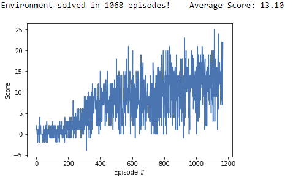
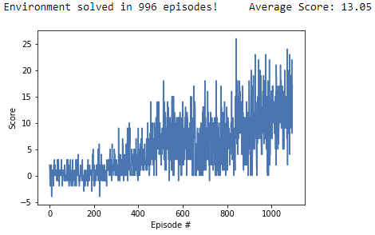

# Project 1 - Navigation using Reinforcement Learning (DQN and Double DQN)

## Introduction

The first project in Udacity Deep Reinforcement Learning nanodegree consists on solving a navigation problem - collecting yellow bananas and avoiding blue bananas in a large, square world - using reinforcement learning. 

Both implementations were based on the samples provided as exercises in the course, modified to use the [Unity ML-Agents](https://github.com/Unity-Technologies/ml-agents/blob/master/docs/Installation.md) environment, and use the [PyTorch](https://www.pytorch.org/) framework.

## The Environment

In this project we'll train an agent to navigate a large, square two-dimensional world, collecting yellow bananas (each one providing a reward of *+1*) and avoiding blue bananas (which provides a negative reward of *-1*). This is an episodic task; the problem is considered solved if the agent get an average score of *+13* over 100 consecutive episodes. 

The state space perceived by the agent is a vector with *37 continuous dimensions*, representing the agent's velocity and (ray-based) information about perceived objects around agent's forward direction. After each observation of the state space, the agent may choose between four discrete actions numbered from 0 to 3: move forward (0), move backward (1), turn left (2) and turn right (3). 

This environment is a variant created for the nanodegree and provided as a compiled Unity binary. The animated image below was part of the problem description and illustrates the problem.


## Getting Started

All the work was performed on a Windows 10 laptop, with a GeForce GTX 970M GPU. The training was performed using CUDA. 

After cloning the project, download and extract the pre-built "Banana" environment using the link adequate to your operational system, in the same directory of the project:

- Linux: [click here](https://s3-us-west-1.amazonaws.com/udacity-drlnd/P1/Banana/Banana_Linux.zip)
- Mac OSX: [click here](https://s3-us-west-1.amazonaws.com/udacity-drlnd/P1/Banana/Banana.app.zip)
- Windows (32-bit): [click here](https://s3-us-west-1.amazonaws.com/udacity-drlnd/P1/Banana/Banana_Windows_x86.zip)
- Windows (64-bit): [click here](https://s3-us-west-1.amazonaws.com/udacity-drlnd/P1/Banana/Banana_Windows_x86_64.zip)

It is also necessary to install [Unity ML-Agents](https://github.com/Unity-Technologies/ml-agents/blob/master/docs/Installation.md), [unityagents](https://pypi.org/project/unityagents/) and [NumPy](http://www.numpy.org/). Our development used an Anaconda (Python 3.6) environment to install all packages.  

## Training the agent

Run `python train.py` to train the agent using Double DQN. The average rewards over 100 consecutive episodes will be printed to the standard output. At the end, the plot showing the agent progress will be saved in the image `training.png`, and the model (weights learned by the agent) will be saved in file `checkpoint.pth`. 

## Running a trained agent

The repository already contains weights trained using DQN and Double DQN (`checkpont_dqn.pth` and `checkpoint_ddqn.pth`, respectively).

Run `python test.py checkpoint_ddqn.pth` to see the agent in action! 

## Report 

The Jupyter notebook `Report.ipynb` to train the agent (alternatively, load the weights of a fully trained agent using DQN or Double DQN, from files `checkpoint_dqn.pth` and `checkpoint_ddqn.pth`) and visualize the results. This notebook also contains a detailed description of the solution. 

## Summary Results

Both DQN and Double DQN were able to solve the problem, i.e., achieve an average score of *+13* over 100 consecutive episodes in less than 1800 episodes of training, with Double DQN achieving a slightly better result:

### DQN
```
Episode 100	Average Score: 0.20
Episode 200	Average Score: 0.66
Episode 300	Average Score: 2.42
Episode 400	Average Score: 5.60
Episode 500	Average Score: 8.05
Episode 600	Average Score: 8.76
Episode 700	Average Score: 8.19
Episode 800	Average Score: 8.57
Episode 900	Average Score: 10.52
Episode 1000	Average Score: 11.49
Episode 1100	Average Score: 12.60
Episode 1168	Average Score: 13.10
Environment solved in 1068 episodes!	Average Score: 13.10
```


### Double DQN
```
Episode 100	Average Score: 0.36
Episode 200	Average Score: 0.26
Episode 300	Average Score: 1.00
Episode 400	Average Score: 2.40
Episode 500	Average Score: 5.38
Episode 600	Average Score: 7.09
Episode 700	Average Score: 6.44
Episode 800	Average Score: 6.16
Episode 900	Average Score: 8.22
Episode 1000	Average Score: 10.64
Episode 1096	Average Score: 13.05
Environment solved in 996 episodes!	Average Score: 13.05
```


