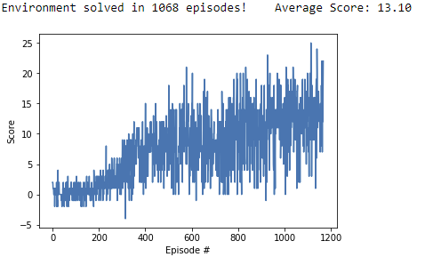
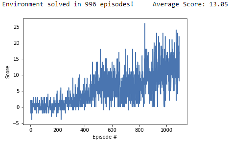

# Project 1 - Navigation using Reinforcement Learning (DQN and Double DQN) - Implementation Report

## Introduction

In this report we describe the implementation of a Deep Q-Netowrk (DQN) for reinforcement learning, used to solve a Navigation problem. Please refer to file `README.md` for a complete description of the specific problem/environment. 

Our solution uses a standard Deep Q-Network (*DQN*) algorithm with *experience replay* and *fixed Q-Targets*, as described in the original [research paper](https://storage.googleapis.com/deepmind-media/dqn/DQNNaturePaper.pdf). 

We also implemented a variant known as Double DQN, which improves performance by avoiding overestimating action values, as described in the [paper](https://storage.googleapis.com/deepmind-media/dqn/DQNNaturePaper.pdf). 

## Reinforcement Learning

In a Reinforcement Learning problem an *agent* observes the *state* _s(t)_ of an *environment* in a given moment of time, and chooses an *action* _a(t)_. When executed the action changes the environment moving it to a new state _s(t+1)_, and the action receives a *reward* _r(t+1)_. The objective of the agent is maximize the reward received after multiple interactions with the environment. In order to achieve this goal the agent must *explore* the environment in  order to find out the best actions given the state, and also to *exploit* the acquired knowledge to collect the rewards.  

## Q-Learning and Q-Networks 

A *policy* is a function that gives the probability of choosing an action _a_ when observing a state _s_. The *optimal policy* is the one that maximizes the estimated reward obtained when following the policy. 

In Q-learning the agent tries to find the optimal action-value function Q, which maps a (state,action) pair to the estimated reward obtained when following the optimal policy. If the environment state is discrete, the action-value function Q can be represented as a table.

If the environment state is continuous, we need to approximate the action-value function Q. This can be done using a neural network as a non-linear function approximator, adjusting its weights according to the observed rewards. 

### Neural Network Architecture 

In our implementation, we use a neural network composed by two 128-node hidden Linear layers with Rectified Linear Units (ReLU). The input layer has 37 nodes, corresponding to the dimension of the environment state. The output layer has 4 nodes, each one corresponding to an action. 

### Experience Replay and Fixed Q-Targets

In order to minimize the correlation between samples we use Experience Replay, as originally proposed in [Human-level control through deep reinforcement learning](https://storage.googleapis.com/deepmind-media/dqn/DQNNaturePaper.pdf): past observations _(s, a, s(t+1), r(t+1))_ are stored in a replay circular buffer, from where random observations are sampled to update the network. 

Another improvement from the same paper is the usage of Fixed Q-Targets: weight updates are performed in a separate network, which periodically updates the network used by the agent. This helps reducing the correlation between the target and current Q values.

### DQN and Double DQN

In the standard DQN the Q target value is updated based on the difference between the previous value provided by the network and the observed reward. This tends to overstimate the action value; an approach to fix this is to use Double DQN, where we choose the next action using the local Q network, but uses in the update step the value of the frozen Q target network. 

### Hyperparameters

The hyperparameters used in our implementation were the following:

Name                            |    Value
--------------------------------|----------------------
Replay Buffer Size              | 1e5
Minibatch size                  | 64
Discount Factor (Gamma)         | 0.99
Tau (for soft update of target parameters) | 1e-3
Learning Rate                              | 5e-4
Frequency of network update                | 25 episodes
Maixmum number of training episodes        | 2000
Maximum number of timesteps per episode    | 10000
Starting value of epsilon for action selection | 1.0
Minimum value of epsilon                   |  0.01
Epsilon decay                              | 0.9995

## Results

Both DQN and Double DQN were able to solve the problem, i.e., achieve an average score of *+13* over 100 consecutive episodes in less than 1800 episodes of training, with Double DQN achieving a slightly better result:

### DQN
```
Episode 100	Average Score: 0.20
Episode 200	Average Score: 0.66
Episode 300	Average Score: 2.42
Episode 400	Average Score: 5.60
Episode 500	Average Score: 8.05
Episode 600	Average Score: 8.76
Episode 700	Average Score: 8.19
Episode 800	Average Score: 8.57
Episode 900	Average Score: 10.52
Episode 1000	Average Score: 11.49
Episode 1100	Average Score: 12.60
Episode 1168	Average Score: 13.10
Environment solved in 1068 episodes!	Average Score: 13.10
```



### Double DQN
```
Episode 100	Average Score: 0.36
Episode 200	Average Score: 0.26
Episode 300	Average Score: 1.00
Episode 400	Average Score: 2.40
Episode 500	Average Score: 5.38
Episode 600	Average Score: 7.09
Episode 700	Average Score: 6.44
Episode 800	Average Score: 6.16
Episode 900	Average Score: 8.22
Episode 1000	Average Score: 10.64
Episode 1096	Average Score: 13.05
Environment solved in 996 episodes!	Average Score: 13.05
```



## Ideas for Future Work

After the original publication of DQN many improvements were proposed. One of them, Double DQN, was implemented in this work, but many others could be tried, for example [Duelling Networks](https://arxiv.org/abs/1511.06581), [Noisy DQN](https://arxiv.org/abs/1706.10295), [Distributional DQN](https://arxiv.org/abs/1707.06887), and a combination of them, as mentionemd in the Udacity Deep Reinforcement Learning lesson about [Rainbow](https://arxiv.org/abs/1710.02298). 

Going further: the most time-consuming part of this work was hyperparameter tuning. One idea to improve this is to use techniques for selecting them automatically, for example implementing a *grid search* or using a *genetic algorithm* to find the best set of parameters. 

